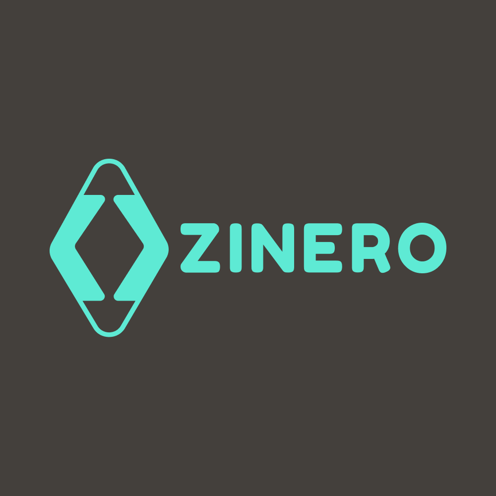

  

# Zinero API

Backend API do projeto **Zinero** para gestao financeira pessoal.

## Overview

A **Zinero API** e uma API Node.js + TypeScript focada em:

- controle de receitas e despesas
- organizacao por categorias, subcategorias e tags
- acompanhamento de contas e cartoes
- autenticacao e sessao de usuario
- feedback, logs e rastreabilidade

## Arquitetura

O backend segue arquitetura em camadas:

- `src/routes` -> definicao de rotas HTTP
- `src/controller` -> orquestracao de request/response
- `src/service` -> regras de negocio
- `src/repositories` -> acesso e persistencia de dados
- `src/db` -> cliente, migracao e schemas
- `src/utils` -> utilitarios cross-cutting

## Dominios atuais

- auth
- users
- accounts
- credit cards
- categories
- subcategories
- tags
- transactions
- feedback
- logs

## Stack tecnica

- Node.js
- TypeScript
- Express
- MySQL
- Drizzle ORM
- Jest
- ESLint

## Estrutura do repositorio (monorepo)

- `backend/` -> API Zinero (fonte de verdade de regras de dominio)
- `shared/` -> contratos compartilhados (types, enums, i18n, DTOs)
- `frontend/` -> app Preact + Vite consumindo os contratos compartilhados

## Scripts principais (backend)

Executar dentro de `backend/`:

- `npm run dev` -> sobe API em modo desenvolvimento
- `npm run build` -> testes CI + build TypeScript
- `npm run start` -> executa build em `dist`
- `npm run lint` -> lint do backend
- `npm run test` -> testes
- `npm run test:coverage` -> cobertura de testes
- `npm run db:generate` -> gera artefatos do Drizzle
- `npm run db:migrate` -> executa migracoes
- `npm run db:sync` -> generate + migrate
- `npm run seed` -> seed padrao
- `npm run seed:10|100|1000` -> seeds com volume

## Variaveis de ambiente

Consulte `backend/.env` para os valores necessarios. Em especial:

- banco (`DB_*`)
- JWT/session
- email provider
- FTP/avatar storage

## Observacoes

- A API usa contratos compartilhados em `@shared/*` para manter consistencia com frontend.
